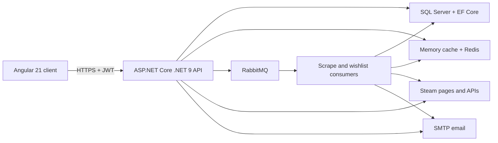

# Steam Web Scraping CRM — Extended Project Description

## Project overview

**Steam Web Scraping CRM** is a full-stack market-intelligence workspace for configuring Steam Community Market data sources, organizing catalog metadata, running repeatable scraping and manual-check workflows, and monitoring products against operator-defined conditions.

The application replaces scattered links, spreadsheets, and one-off market checks with a single operational system. Users can model games and market URLs, connect products to tags and pixel signatures, execute listing analysis, review scrape history, maintain watch and wish lists, and export filtered results for offline analysis.

The product is designed for three closely related activities:

- **Catalog operations** — maintain games, source URLs, products, tags, item groups, pixel definitions, and their relationships.
- **Market analysis** — collect Steam listing data through page, public-API, and pixel-assisted workflows, then match it against configurable criteria.
- **Monitoring automation** — queue manual checks, retain run history, schedule wish-list checks, and distribute longer-running work through background services and RabbitMQ.

> **Product callout — one control surface:** The value of the system is not scraping alone. It combines source configuration, domain metadata, condition matching, execution history, exports, and user-scoped operations in one authenticated workspace.

> **Disclaimer:** Steam Web Scraping CRM is not affiliated with, endorsed by, or sponsored by Valve Software.

## Repository snapshot

The following metrics describe the repository as of **August 30, 2026**. They are source-level measurements, not production traffic or business KPIs.

| Metric | Repository snapshot |
| --- | ---: |
| Declared HTTP operations | **113** — 81 Minimal API mappings and 32 controller actions |
| API surface modules | **14** Minimal API endpoint modules and **3** API controllers |
| Active Angular route declarations | **35** |
| Angular UI building blocks | **51** component declarations and **24** injectable declarations |
| Domain entities | **20** entity types |
| Backend application source | **264** C# files, excluding tests, EF migrations, and generated build output |
| Frontend application source | **185** files — 118 TypeScript, 33 HTML, and 34 SCSS files, excluding test specifications |
| Test declarations | **541** — 334 NUnit `[Test]`/`[TestCase]` declarations and 207 Jasmine/Jest/Playwright `it`/`test` declarations |
| Test source files | **123** — 55 server test files and 68 client test specifications |
| EF Core migration history | **30** migration files, excluding designers and the model snapshot |

Test declarations are counted from source and may expand into additional runtime cases through parameterization. The figures describe the checked-in engineering footprint; they do not imply that every test was executed for this documentation change.

## What problem it solves

Steam market research becomes difficult to reproduce when source URLs, product definitions, quality rules, price thresholds, and results live in separate tools. Steam Web Scraping CRM turns those moving parts into durable, related records and repeatable workflows.

The system helps operators:

1. standardize how a market source is configured;
2. describe which products and visual attributes matter;
3. reuse tags, item groups, and matching criteria across checks;
4. run work immediately or through a queue;
5. preserve status, history, and partial results;
6. monitor target items without repeating the same manual process;
7. export a filtered data set when deeper spreadsheet analysis is useful.

## Core capabilities

### Catalog and source configuration

The catalog provides the shared context for every monitoring and scraping workflow:

- **Games** define the top-level market context.
- **Game URLs** capture Steam source information and scraping configuration.
- **Products** represent the item definitions that operators want to find or monitor.
- **Tags** and **item groups** provide a reusable classification and grouping model.
- **Pixels** represent RGB-based visual signatures used by pixel-assisted checks.
- **Scraping modes** describe supported collection strategies.

The principal many-to-many relationships are managed in the context of the main records:

- Game URL ↔ Product
- Game URL ↔ Pixel
- Product ↔ Tag

This keeps relationship management close to the operator's task instead of exposing raw join-table administration.

### Manual market checks

Manual Mode supports configurable, repeatable listing evaluation rather than a single hard-coded search. Operators can create presets, group criteria, choose match behavior, start a run, and inspect the resulting status and history.

The backend uses a channel-backed queue and a hosted worker for this flow. Runs can be stopped or rerun, while execution state and partial outcomes remain available to the UI.

### Scraping and result history

The scraping layer supports several source strategies, including Steam listing pages, public endpoints, and pixel-assisted validation. Selenium and HTML parsing cover browser-oriented collection, while dedicated application services normalize execution and persistence behavior.

Scrape-history records retain the request context, outcome, status, and error information. Selected runs can be replayed directly or queued through the message broker.

### Watch-list and wish-list monitoring

- **Watch List** keeps priority products and market targets visible for ongoing review.
- **Wish List** captures price-oriented target conditions and participates in scheduled checking and notification workflows.

Wishlist automation combines a hosted job, distributed cache coordination, RabbitMQ messages, consumers, and email delivery. The API scopes wishlist access to the current user, while broker messages retain the wishlist identifier, delivery target, request time, and correlation ID needed by the background path.

### Feedback and administration

Authenticated users can create and follow feedback requests with reference identifiers and status history. Administrative API and UI paths support user and role management, while ordinary catalog and monitoring operations remain user-scoped.

### Filtering and export

Data-heavy screens emphasize filter-first tables. XLSX export lets operators move the current result set into a spreadsheet for reporting or exploratory analysis without making the spreadsheet the system of record.

## Typical user flows

### Onboard a new market context

1. Create a game.
2. Configure one or more Steam market URLs.
3. Add products, tags, item groups, and optional pixel signatures.
4. Link products and pixels to the relevant source URLs.
5. Use the resulting catalog in manual checks, watch lists, or wish lists.

### Run a manual check

1. Choose or create a preset.
2. Define criteria and grouping behavior.
3. Select the relevant game/source context.
4. Queue the run.
5. Follow execution status, stop it if necessary, and inspect matches or errors.
6. Rerun the saved configuration when market conditions change.

### Automate wish-list monitoring

1. Create a user-owned wish-list target and threshold.
2. Let the hosted schedule publish work to RabbitMQ.
3. Process checks and notifications through scoped consumers.
4. Use Redis-backed coordination to prevent overlapping or duplicate work.
5. Review the resulting market state and adjust the target.

## System architecture



### Backend ownership boundaries

The server follows the repository's established project-reference graph:

| Project | Responsibility |
| --- | --- |
| `SteamApp.Models` | Domain entities, enums, value objects, and constants |
| `SteamApp.Application` | DTOs, mapping profiles, operation results, cache keys, JSON models, and application utilities |
| `SteamApp.Interfaces` | Repository and service contracts |
| `SteamApp.Infrastructure` | EF Core context, repositories, Identity persistence, scraping integrations, email, encryption, and retry services |
| `SteamApp.WebAPI` | API composition, endpoints, controllers, security, jobs, manual-check orchestration, RabbitMQ messages and consumers, and caching configuration |
| `SteamApp.WebApiClient` | Typed .NET API-client managers |

`Application` references `Domain`; `Interfaces` references `Application` and `Domain`; `Infrastructure` references all three; and `WebAPI` composes the system through `Infrastructure`. The layout favors explicit ownership over a generic one-size-fits-all layering template.

### Angular client structure

The Angular client is a standalone application with lazy-loaded route components. Its main source areas are:

- `pages/` for route-level catalog, scraping, monitoring, profile, feedback, and public product screens;
- `components/` for reusable dialogs, navigation, status, timing, and utility UI;
- `services/` for typed API access, authentication, loading/error handling, SEO, and external-link disclosure;
- `models/` for client-side API contracts;
- `common/` for focused shared directives and utilities.

Public product pages are indexable, while authenticated workspace routes use guarded navigation and private search-engine metadata.

## Tech stack callouts

> **Frontend — Angular 21:** Angular 21.2, Angular Material/CDK 21.2, TypeScript 5.9, RxJS 7.8, SCSS, and Tailwind CSS 3.4 provide a standalone, lazy-loaded client. XLSX and FileSaver support exports.

> **API — .NET 9:** ASP.NET Core combines Minimal APIs for catalog-oriented resources with controllers for authentication, manual checks, and scraping orchestration. OpenAPI is exposed through Swashbuckle.

> **Data — EF Core + SQL Server:** A single `ApplicationDbContext` stores both ASP.NET Core Identity data and SteamApp business data. EF Core 9 migrations evolve the schema, while repository and operation-scoped context patterns protect async work.

> **Automation — RabbitMQ + hosted workers:** RabbitMQ carries scrape, wishlist-check, and notification messages. Hosted services handle manual-check queues and scheduled wishlist dispatch without tying long-running work to an HTTP request.

> **Caching — memory + Redis:** In-memory caching accelerates frequently read catalog and scrape data. Redis-backed distributed caching coordinates work that must remain consistent across API and worker paths.

> **Scraping — Selenium + HtmlAgilityPack:** Selenium WebDriver supports browser-dependent flows; HtmlAgilityPack covers HTML parsing. Retry policies, cancellation, run state, and persisted history make failures observable and recoverable.

> **Security — Identity + JWT:** ASP.NET Core Identity, JWT bearer authentication, user/admin/internal-job policies, ownership filtering, rate limits, controlled CORS, HSTS, and environment-based secret loading protect the application boundary.

> **Testing — three levels on both stacks:** NUnit, Moq, ASP.NET Core TestHost, SQLite/InMemory EF, and `WebApplicationFactory` cover the server. Jasmine/Karma, Jest, and Playwright cover client unit, integration, and browser-level behavior.

### Stack reference

| Concern | Primary technology |
| --- | --- |
| Web client | Angular 21.2, Angular Material/CDK, RxJS, TypeScript 5.9 |
| Styling | SCSS, Tailwind CSS 3.4, PostCSS, Autoprefixer |
| API | ASP.NET Core on .NET 9, Minimal APIs, MVC controllers |
| Persistence | EF Core 9.0, SQL Server, ASP.NET Core Identity |
| Mapping and serialization | AutoMapper 15, Newtonsoft.Json |
| API documentation | Swashbuckle / OpenAPI |
| Browser scraping | Selenium WebDriver 4.43, Selenium support helpers |
| HTML processing | HtmlAgilityPack 1.12 |
| Messaging | RabbitMQ.Client 7.1 |
| Caching | ASP.NET Core memory cache, StackExchange Redis integration |
| Email | MailKit and SMTP configuration |
| Credential protection | JWT validation and Argon2-based cryptography support |
| Client tests | Jasmine/Karma, Jest 30, Playwright 1.59 |
| Server tests | NUnit 4, Moq, TestHost, `WebApplicationFactory`, coverlet |
| Local infrastructure | Docker Compose, SQL Server 2022, Redis 7, optional docker-mailserver and Certbot |

Versions above reflect the checked-in project manifests and are intentionally more specific than the conceptual architecture.

## Security and operational characteristics

### Authentication and authorization

- JWTs validate issuer, audience, signature, and lifetime with a bounded clock skew.
- ASP.NET Core Identity enforces unique email addresses, password rules, and account lockout.
- Policies distinguish authenticated API users, administrators, and internal jobs.
- Entity queries enforce user ownership for user-specific records.
- Auth, general API, and expensive API operations use separate rate-limit policies.

### External data and links

Steam pages, public endpoints, message payloads, and user-supplied URLs are treated as external input. The client preserves a disclosure flow before users open unverified third-party destinations and opens them with browser isolation protections.

### Reliability

- Startup fails fast when required database or JWT configuration is missing.
- Database migrations use bounded retry behavior during startup.
- Background loops and consumers contain failures at the unit-of-work boundary.
- Cancellation tokens are propagated through cancellable database, HTTP, queue, and scraping work.
- Scrape and manual-check history make partial results and failures inspectable.
- Cache keys are centralized and namespaced by resource or job identifiers.

### Configuration and secrets

Configuration is loaded in this order:

1. `appsettings.json`;
2. `appsettings.{Environment}.json`;
3. .NET user secrets in Development;
4. environment variables as the final override.

Real connection strings, JWT keys, client secrets, and mail credentials are expected outside tracked configuration.

## Testing strategy

The repository separates fast behavioral checks from broader integration boundaries:

- **Server unit tests** validate services, repositories, controllers, Minimal APIs, security metadata, migrations, queues, and retry behavior.
- **Server integration tests** exercise the hosted API, relational EF behavior, startup configuration, security pipeline, contracts, jobs, and external-service adapters.
- **Server end-to-end tests** cover catalog, repository, scraping, wishlist, and security behavior against the composed system.
- **Client unit tests** cover components, forms, services, guards, interceptors, directives, matching utilities, and state handling.
- **Client integration tests** cover multi-component flows such as login, games, scraping, and scrape history.
- **Playwright tests** exercise browser-level authentication, catalog creation, and scraping flows.

## Deployment and local development

The application can be run directly with the .NET and Angular toolchains or assembled with containerized dependencies.

- The Windows local-release launcher starts the .NET API and optimized Angular client against an existing SQL Server LocalDB database.
- Root Docker Compose configuration provides SQL Server 2022 and Redis 7 with persistent volumes.
- Client and API Dockerfiles support container builds.
- Optional mail infrastructure uses docker-mailserver, Rspamd, ClamAV, Fail2Ban, and Certbot-managed TLS certificates.

For setup commands, required secrets, ports, and troubleshooting guidance, see [Getting Started](GETTING_STARTED.md).

## Project structure

```text
SteamApp/
├── SteamApp.Client/                     Angular application
│   ├── src/app/pages/                   Route-level UI
│   ├── src/app/components/              Reusable UI
│   ├── src/app/services/                API and application services
│   └── e2e/                             Playwright scenarios
├── SteamApp.Server/
│   ├── SteamApp.Models/                 Domain model
│   ├── SteamApp.Application/            DTOs and application utilities
│   ├── SteamApp.Interfaces/             Contracts
│   ├── SteamApp.Infrastructure/         Persistence and external integrations
│   ├── SteamApp.WebAPI/                 API host, security, jobs, and messaging
│   ├── SteamApp.WebApiClient/           Typed .NET API clients
│   ├── SteamApp.Tests/                  Unit tests
│   ├── SteamApp.IntegrationTests/       Integration tests
│   └── SteamApp.E2ETests/               Server end-to-end tests
├── docs/                                Product and engineering documentation
├── docker-compose.yml                   SQL Server and Redis
└── docker-compose.mail.yml              Optional self-hosted mail stack
```

## Project position

Steam Web Scraping CRM is best understood as an **operations platform for Steam market intelligence**, not a generic customer-contact CRM. Its differentiator is the combination of a relational catalog, reusable matching rules, multiple scraping strategies, queued and scheduled execution, user-scoped history, and export-ready analysis in one maintainable full-stack system.

The repository already demonstrates production-oriented concerns—authentication, authorization, rate limiting, caching, message delivery, background processing, migrations, observability, and multi-level tests—while remaining structured so another developer can extend an existing domain or workflow without introducing a parallel architecture.
